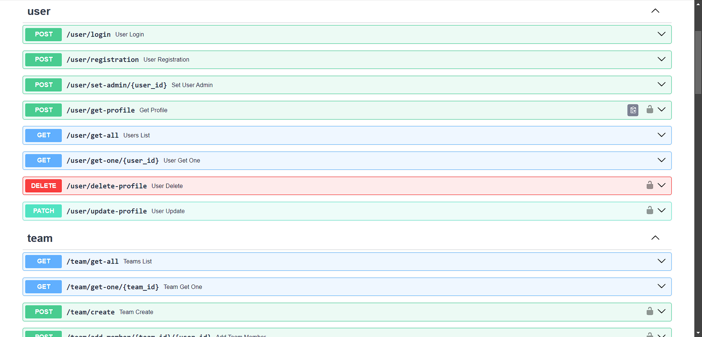
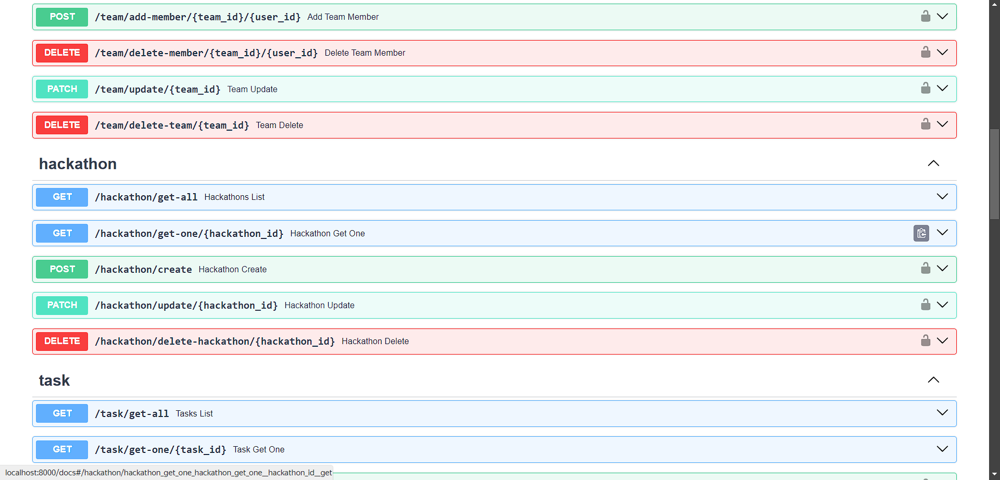
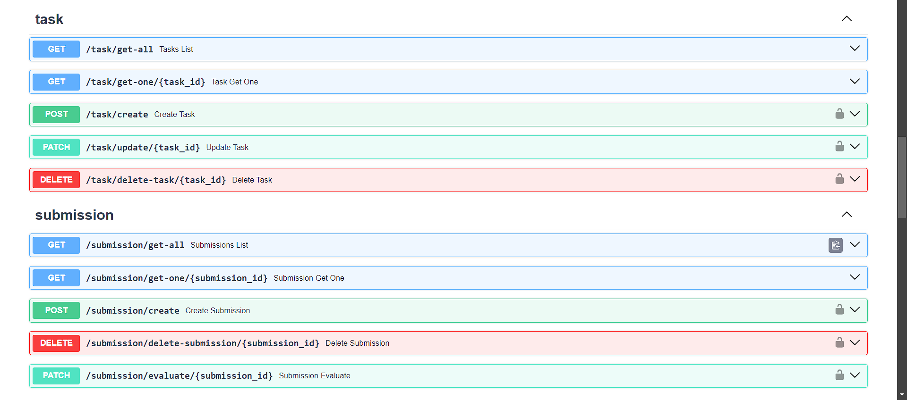

## Лабораторная работа 1. Реализация серверного приложения FastAPI

### Описание

Задача состоит в разработке программной системы, которая будет использоваться для организации и проведения хакатонов. Хакатон - это соревнование, на котором участники, как правило, программисты, дизайнеры и бизнес-специалисты, работают над проектами в течение определенного времени, решая поставленные задачи или разрабатывая новые идеи. Система должна предоставлять следующий функционал:

Регистрация участников: Участники должны иметь возможность зарегистрироваться на хакатон, указав свои данные (имя, адрес электронной почты, контактный номер и т. д.). После регистрации участники должны получить подтверждение от организаторов.

Формирование команд: Участники должны иметь возможность создавать команды или присоединяться к уже существующим. Команды могут состоять из участников с различными навыками (программирование, дизайн, маркетинг и т. д.).

Публикация задач: Организаторы хакатона должны иметь возможность публиковать задачи или проекты, над которыми будут работать участники. Каждая задача должна содержать описание, требования и критерии оценки.

Оценка работ: Участники должны иметь возможность загружать свои работы и прототипы для оценки.

Скриншоты документации swagger:





Код JWT-авторизации:
```python
class AuthHandler:
    security = HTTPBearer()
    pwd_context = CryptContext(schemes=['bcrypt'])
    secret = '256-bit-secret-asfsdgdafjbzvoizpo'

    def get_password_hash(self, password):
        return self.pwd_context.hash(password)

    def verify_password(self, pwd, hashed_pwd):
        return self.pwd_context.verify(pwd, hashed_pwd)

    def encode_token(self, sub_data):
        payload = {
            'exp': datetime.datetime.utcnow() + datetime.timedelta(hours=24),
            'iat': datetime.datetime.utcnow(),
            'sub': str(sub_data)
        }
        return jwt.encode(payload, self.secret, algorithm='HS256')

    def decode_token(self, token):
        try:
            payload = jwt.decode(token, self.secret, algorithms=['HS256'])
            return payload['sub']
        except jwt.ExpiredSignatureError:
            raise HTTPException(status_code=401, detail='Expired signature')
        except jwt.InvalidTokenError:
            raise HTTPException(status_code=401, detail='Invalid token')

    def auth_wrapper(self, auth: HTTPAuthorizationCredentials = Security(security)):
        return self.decode_token(auth.credentials)

    def get_user(self, auth: HTTPAuthorizationCredentials = Security(security)):
        credentials_exception = HTTPException(
            status_code=status.HTTP_401_UNAUTHORIZED,
            detail='Could not validate credentials'
        )
        token_data = self.decode_token(auth.credentials)
        if token_data is None:
            raise credentials_exception
        return int(token_data)
```

### Запустить локально

#### Установить зависимости

```bash
pip install -r requirements.txt 
```

#### Запустить сервер

```bash
uvicorn app:app --port 8000
```

#### Выполнить миграции

```bash
alembic revision --autogenerate -m "change [table name]"
alembic upgrade head
```