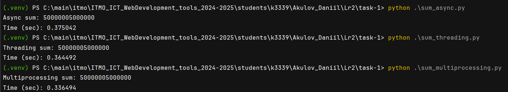

## Лабораторная работа 2. Потоки. Процессы. Асинхронность.

### Описание

#### Задача 1. Различия между threading, multiprocessing и async в Python

**Задача:** Напишите три различных программы на Python, использующие каждый из подходов: threading, multiprocessing и async. Каждая программа должна решать считать сумму всех чисел от 1 до 10000000000000. Разделите вычисления на несколько параллельных задач для ускорения выполнения.

**Подробности задания:**
1. Напишите программу на Python для каждого подхода: threading, multiprocessing и async.
2. Каждая программа должна содержать функцию calculate_sum(), которая будет выполнять вычисления.
3. Для threading используйте модуль threading, для multiprocessing - модуль multiprocessing, а для async - ключевые слова async/await и модуль asyncio.
4. Каждая программа должна разбить задачу на несколько подзадач и выполнять их параллельно.
5. Замерьте время выполнения каждой программы и сравните результаты.


#### Задача 2. Параллельный парсинг веб-страниц с сохранением в базу данных
**Задача:** Напишите программу на Python для параллельного парсинга нескольких веб-страниц с сохранением данных в базу данных с использованием подходов threading, multiprocessing и async. Каждая программа должна парсить информацию с нескольких веб-сайтов, сохранять их в базу данных.

**Подробности задания:**
1. Напишите три различных программы на Python, использующие каждый из подходов: threading, multiprocessing и async.
2. Каждая программа должна содержать функцию parse_and_save(url), которая будет загружать HTML-страницу по указанному URL, парсить ее, сохранять заголовок страницы в базу данных и выводить результат на экран.
3. Используйте базу данных из лабораторной работы номер 1 для заполенния ее данными. Если Вы не понимаете, какие таблицы и откуда Вы могли бы заполнить с помощью парсинга, напишите преподавателю в общем чате потока.
4. Для threading используйте модуль threading, для multiprocessing - модуль multiprocessing, а для async - ключевые слова async/await и модуль aiohttp для асинхронных запросов.
5. Создайте список нескольких URL-адресов веб-страниц для парсинга и разделите его на равные части для параллельного парсинга.
6. Запустите параллельный парсинг для каждой программы и сохраните данные в базу данных.
7. Замерьте время выполнения каждой программы и сравните результаты.

### Выполнение

#### Задача 1

Код `sum_async.py`:
```python
async def calculate_sum(start, end):
    return sum(range(start, end))


async def main():
    num_tasks = 10
    chunk_size = 10000000 // num_tasks
    tasks = []
    for i in range(num_tasks):
        start = i * chunk_size + 1
        end = (i + 1) * chunk_size + 1
        task = asyncio.create_task(calculate_sum(start, end))
        tasks.append(task)
    results = await asyncio.gather(*tasks)
    total_sum = sum(results)
    print("Async sum:", total_sum)


if __name__ == "__main__":
    start_time = time.time()
    asyncio.run(main())
    end_time = time.time()
    print(f"Time (sec): {end_time - start_time:.6f}")
```

Код `sum_multiprocessing.py`:
```python
def calculate_sum(start, end, results):
    results.put(sum(range(start, end)))


def main():
    num_threads = 4
    chunk_size = 1000000 // num_threads
    threads = []
    results = multiprocessing.Queue()
    for i in range(num_threads):
        start = i * chunk_size + 1
        end = (i + 1) * chunk_size + 1
        thread = multiprocessing.Process(target=calculate_sum, args=(start, end, results))
        threads.append(thread)
        thread.start()
    for thread in threads:
        thread.join()
    total_sum = 0
    while not results.empty():
        total_sum += results.get()
    print("Multiprocessing sum:", total_sum)


if __name__ == "__main__":
    start_time = time.time()
    main()
    end_time = time.time()
    print(f"Time (sec): {end_time - start_time:.6f}")
```

Код `sum_threading.py`:
```python
def calculate_sum(start, end, results):
    results.append(sum(range(start, end)))


def main():
    num_threads = 4
    chunk_size = 1000000 // num_threads
    threads = []
    results = []
    for i in range(num_threads):
        start = i * chunk_size + 1
        end = (i + 1) * chunk_size + 1
        thread = threading.Thread(target=calculate_sum, args=(start, end, results))
        threads.append(thread)
        thread.start()
    for thread in threads:
        thread.join()
    total_sum = sum(results)
    print("Threading sum:", total_sum)


if __name__ == "__main__":
    start_time = time.time()
    main()
    end_time = time.time()
    print(f"Time (sec): {end_time - start_time:.6f}")
```

Результат выполнения:


Таблица сравнения времени выполнения

| Метод                        | Время выполнения (секунд) |
|------------------------------|---------------------------|
| Потоки (`threading`)          | 0.36                      |
| Процессы (`multiprocessing`)  | 0.33                      |
| Асинхронность (`asyncio`) | 0.37                      |

Все способы заняли примерно одинаковое время. Но multiprocessing занял меньше всего времени.

#### Задача 2

Список ссылок для парсинга:
```python
urls = [
    'https://www.хакатоны.рус/tpost/0kblp5ouv1-vnedreid',
    'https://www.хакатоны.рус/tpost/o5y3kpvtj1-architech',
    'https://www.хакатоны.рус/tpost/80uis0egp1-go-ctf-2025',
    'https://www.хакатоны.рус/tpost/yd4yk40ta1-forum',
    'https://www.хакатоны.рус/tpost/eculsok1x1-unithack-2025',
    'https://www.хакатоны.рус/tpost/dp1t70lav1-tech-squad-missiya-ii',
    'https://www.хакатоны.рус/tpost/3i2n66z1y1-kiberhak',
    'https://www.хакатоны.рус/tpost/imklbzv241-belie-hakeri',
    'https://www.хакатоны.рус/tpost/1fhvmnaa81-gorod-geroev'
]
```

Код функция для парсинга сайта и сохранения в бд:
```python
html_paths = {
    "title": '#rec488755787 > div > div > div.t-feed__post-popup__container.t-container.t-popup__container.t-popup__container-static > div.t-feed__post-popup__content-wrapper > div:nth-child(3) > div.t-feed__post-popup__title-wrapper > h1',
    'description': '#feed-text > div > section > div > div:nth-child(1)'
}


def _get_text_from_html(tag, default_text):
    return tag.text.strip() if tag else default_text


def parse_page(html_data):
    bs = BeautifulSoup(html_data, 'lxml')
    title_tag = bs.select_one(html_paths.get('title'))
    title = _get_text_from_html(title_tag, "No title")
    description_tag = bs.select_one(html_paths.get('description'))
    description = _get_text_from_html(description_tag, "No description")
    return {'title': title, 'description': description}


def parse_and_save_page(html_data):
    data = parse_page(html_data)
    with next(get_session()) as session:
        hackathon = Hackathon(
            name=data["title"],
            description=data["description"],
            start_date=datetime.now(),
            end_date=datetime.now() + timedelta(days=7),
        )
        session.add(hackathon)
        session.commit()
```

Таблица сравнения времени выполнения

| Метод                        | Время выполнения (секунд) |
|------------------------------|---------------------------|
| Потоки (`threading`)          | 0.56                      |
| Процессы (`multiprocessing`)  | 2.06                      |
| Асинхронность (`asyncio`) | 0.76                      |

**Потоки (threading):**

Потоки в Python хорошо подходят для задач, связанных с вводом-выводом (I/O-bound), таких как сетевые запросы или работа с файлами. Поскольку парсинг HTML и взаимодействие с базой данных, использование потоков дало наилучший результат. Потоки позволяют эффективно использовать время ожидания, когда программа ждет ответа от сервера или базы данных.

**Процессы (multiprocessing):**

Модуль multiprocessing создает отдельные процессы, что позволяет обойти ограничения GIL (Global Interpreter Lock) в Python. Однако для задач, которые в основном зависят от I/O, накладные расходы на создание и управление процессами могут привести к увеличению времени выполнения. Использование процессов оказалось менее эффективным, чем потоки, из-за этих накладных расходов.

**Асинхронность (asyncio):**

Асинхронный подход также хорошо подходит для I/O-bound задач, так как он позволяет выполнять другие операции, пока ожидается завершение текущей. Асинхронный метод показал результат, близкий к потокам, но немного медленнее. Это может быть связано с тем, что асинхронный код требует больше времени на управление событиями и контекстами.

