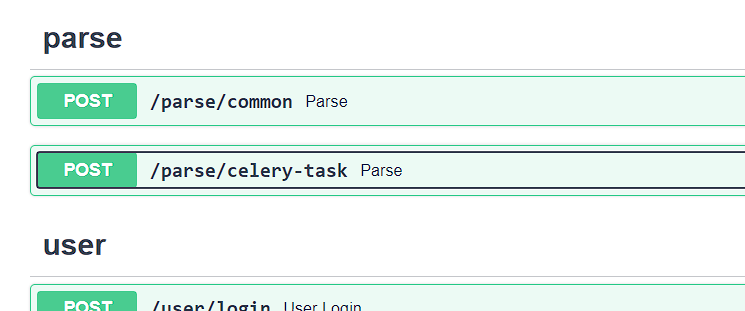
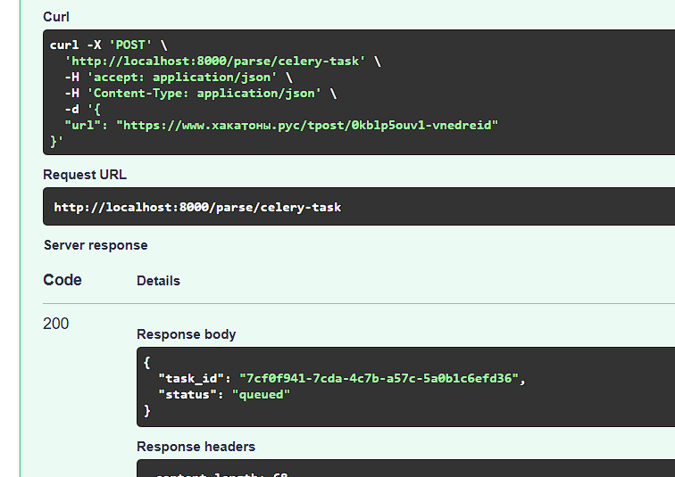

## Лабораторная работа 3. Упаковка FastAPI приложения в Docker, Работа с источниками данных и Очереди

### Выполнение

*Dockerfile* приложения FastApi:
```
FROM python:3.13-slim

WORKDIR /app

COPY requirements.txt /app/

RUN pip install --no-cache-dir -r /app/requirements.txt

COPY ./app /app

EXPOSE 8000

CMD ["uvicorn", "app:app", "--host", "0.0.0.0", "--port", "8000"]
```


*Dockerfile* приложения парсера:
```
FROM python:3.11-slim

WORKDIR /parser

COPY requirements.txt /parser/

RUN pip install --upgrade pip \
 && pip install --no-cache-dir -r /parser/requirements.txt

COPY ./parser /parser

EXPOSE 8001

CMD ["uvicorn", "app:app", "--host", "0.0.0.0", "--port", "8001"]
```

*docker-compose.yaml*:
```
services:
  postgres:
    image: postgres:15
    env_file:
      - .env
    volumes:
      - postgres:/data/postgres
    ports:
      - "5436:5432"

  api:
    build:
      context: .
      dockerfile: app.Dockerfile
    ports:
      - "8000:8000"
    env_file:
      - .env
    depends_on:
      - postgres

  parser:
    build:
      context: .
      dockerfile: parser.Dockerfile
    ports:
      - "8001:8001"
    env_file:
      - .env
    depends_on:
      - postgres
      - api

  redis:
    image: redis
    ports:
      - "6379:6379"
    volumes:
      - redis:/data

  celery:
    build:
      context: .
      dockerfile: parser.Dockerfile
    command: ['python', '-m', 'celery', '-A', 'celery_config.celery_app', 'worker']
    depends_on:
      - redis
      - postgres
      - parser
    env_file:
      - .env

volumes:
  postgres:
  redis:
```

*celery_config*:
```python
from celery import Celery
from parser import parse_and_save_page
import requests

celery_app = Celery("parser", broker='redis://redis:6379/0', backend='redis://redis:6379/0')

@celery_app.task(name="parse_from_url")
def parse_from_url(url: str):
    try:
        response = requests.get(url)
        response.raise_for_status()
        hackathon = parse_and_save_page(response.text)
    except requests.RequestException as e:
        print(f"Error processing {url}: {e}")
```

*parser.app*:
```python
app = FastAPI()

@app.post("/parse")
def parse_url(data: ParseRequest):
    try:
        response = requests.get(url)
        response.raise_for_status()
        hackathon = parse_and_save_page(response.text)
        return {"hackathon": hackathon}
    except requests.RequestException as e:
        raise HTTPException(status_code=500, detail=str(e))


@app.post("/parse-trigger")
async def trigger_parse(data: ParseRequest):
    task = parse_from_url.delay(data.url)
    return {"message": "Parse task started", "task_id": task.id}
```

Эндпоинты для взаимодействия с parser:


Вызов выполнение таски из fastapi приложения:

